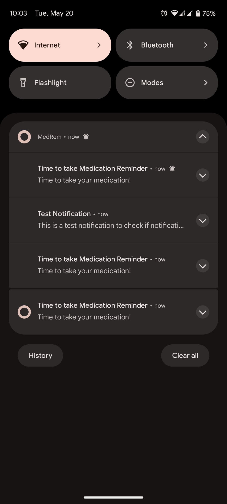

# 💊 MedRem - Medication Reminder App


## 📱 About
MedRem is a modern medication reminder application built with the latest Android technologies. It helps users track their medication schedules, set recurring reminders, and never miss a dose again.

## ✨ Features

- 🔔 **Smart Notifications** - Receive timely medication reminders
- 🔄 **Recurring Schedules** - Create daily, weekly, or custom repeating reminders
- 🎨 **Color Coding** - Assign different colors to different medications
- 📊 **Adherence Tracking** - View your medication adherence stats
- 🏆 **Streak Tracking** - Monitor your consistent medication-taking streaks
- 📈 **Insights & Feedback** - Get helpful insights based on your adherence patterns
- 🌙 **Dark Theme** - Full dark mode support
- 🔒 **Privacy Focused** - All data stored locally on device

## 🛠️ Tech Stack

* **Architecture Pattern**
  * MVVM (Model-View-ViewModel)

* **UI**
  * Jetpack Compose
  * Material Design 3
  * Dynamic Theming

* **Backend & Data**
  * SqlDelight
  * Kotlin Coroutines
  * Flow
  * Kotlin Serialization

* **Dependency Injection**
  * Dagger Hilt
  
* **Other Libraries**
  * AndroidX
  * Android Notifications API
  * Compose Navigation

## 📱 Screenshots

### Edit Reminder Screen


### Adherence Tracking Screen


### Notification System


## 🚀 Installation

The app is currently in development. To try it out:

1. Clone the repository
   ```bash
   git clone https://github.com/AdoyoClifford/medrem-main.git
````
